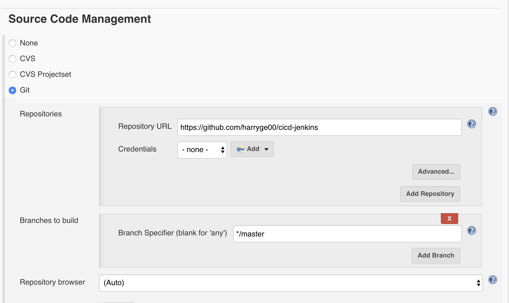
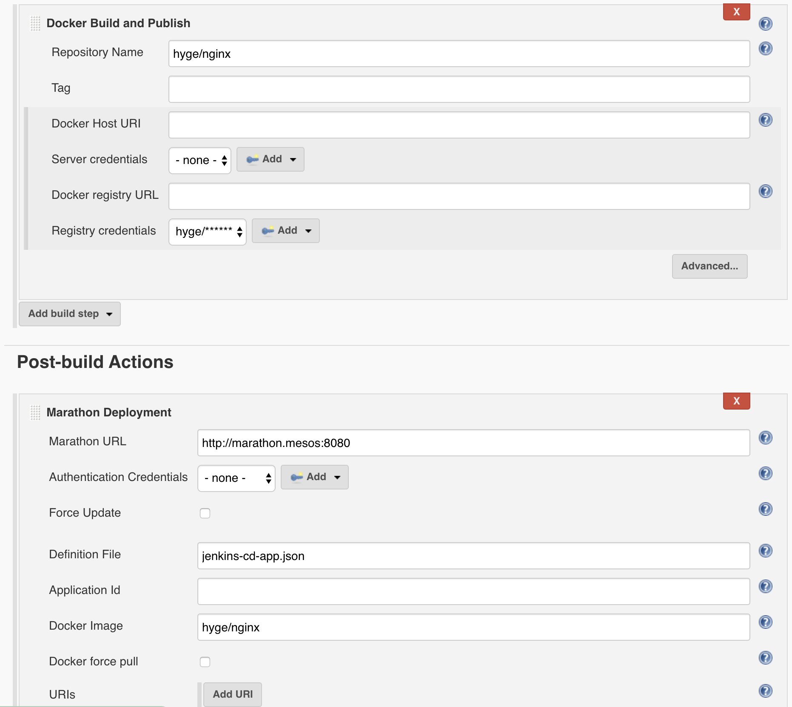

# cicd-jenkins

1. Create a new jenkins freestyle project

2. Add https://github.com/harryge00/cicd-jenkins.git as the github repository.

3. Add docker repo and marathon deployment

4. Build now and check DC/OS
`